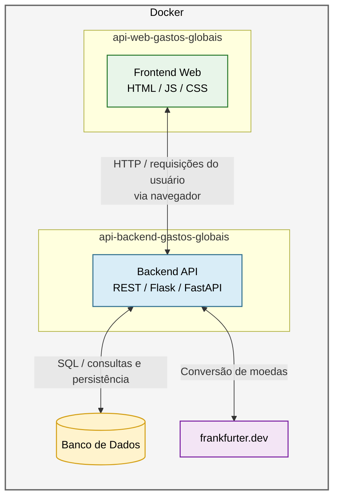

# Gastos Globais API

Esse projeto é o desenvolvimento Back-end para a aplicação Gastos Globais, que é o MVP de Arquitetura de Software do programa de Pós-graduação de 2026 da PUC-Rio -> Criada por Sergio Gustavo M. P. Moreira

Essa aplicação faz uso da API externa [Frankfurter.dev](https://frankfurter.dev/pt/) para realização de conversões cambiais em tempo real. O projeto visa apresentar um controlador de despesas globais.

## Como Executar

Serão necessárias algumas instalações de dependências em sua máquina caso queira utilizar. Primeiramente vamos abordar como foi construída a aplicação detalhe por detalhe.

Primeiramente foi criado um ambiente virtual para execução e controle de versionamento do Python e das bibliotecas importadas para uso da aplicação.

### Criando o Ambiente Virtual

Na pasta do projeto foi executado o comando para criação do ambiente virtual Python, utilizada a versão Python 3.12 para sua criação.

O comando a ser utilizado para criação do banco de dados é 

--> ```python -m venv gastosglobaisvenv```

Após isso será criado o ambiente virtual para o projeto e ali devem ser instaladas as dependencias do projeto.

Ative o ambiente virtual com o seguinte comando:

--> ```.gastosglobaisvenv/Scripts/activate.ps1```

Assim aparecerá o ambiente virtual ativo antes do path e poderá instalar as dependencias com o seguinte comando:

--> ```python -m pip install requirements.txt```

Caso alguma dependencia não seja instalada, como ocorreu em alguns casos de testes em máquinas diferentes, recomendo que seja validada a instalação das bibliotecas que deram algum problema, seguem os comandos:
```
--> python -m pip install flask-cors
--> python -m pip install flask-openapi3
--> python -m pip install SQLAlchemy
--> python -m pip install -U flask-openapi3[swagger,redoc,rapidoc,rapipdf,scalar,elements]
```
Algumas dessas bibliotecas infelizmente não vieram junto ao executar a instalação dos requirements, sempre importante validar.

Agora com as requisições instaladas, precisamos ir para a criação e instanciação do banco de dados.

## Criando o banco de dados

O banco de dados da aplicação é gerado automaticamente através do flask migrate, um comando que utiliza as entidades (models) do nosso sistema para gerar as tabelas no banco de dados, principalmente com auxílio da biblioteca SQLAlchemy. Lembra bastante o famoso Entity-Framework.

Devemos iniciar a construção do banco de dados através do comando a seguir:

--> ```flask db init```

Isso fará com que o sistema gere o database.db , que receberá os dados da nossa aplicação.

Após iniciar devemos gerar a primeira migration, que é um versionamento de instância do nosso banco de dados. Seguindo o comando:

--> ```flask db migrate -m "Estrutura Inicial da base de dados"```

Assim criaremos uma migration com uma label de Estrutura Inicial da base de dados, nos ajudará a identificar esse primeiro passo.

Após isso feito, o comando para instanciar na base de dados deverá ser executado:

--> ```flask db upgrade```

Assim, teremos todas nossas classes no banco de dados conforme previsto.

## Executando a aplicação

Agora que temos nosso ambiente configurado, nosso banco de dados instanciado, devemos iniciar a aplicação backend. O comando a seguir irá iniciar a aplicação:

--> ```python app.py```

Assim, teremos nossa aplicação funcionando em ambiente local, normalmente configurada para a rota http://localhost:5000.

# Acessando o Swagger

Para acessar o Swagger, basta acessar a rota http://localhost:5000/v1/swagger

Assim conseguiremos testar os endpoints da aplicação com mockups e verificar todas as rotas que a API possui.


## Fluxo da aplicação



# Usando o Docker

Para executar a aplicação usando o Docker, siga os passos abaixo:

1. Certifique-se de ter o Docker instalado em sua máquina. Se ainda não tiver, você pode baixá-lo e instalá-lo a partir do site oficial: [Docker](https://www.docker.com/).

2. Clone o repositório para uma pasta de sua preferência, na mesma pasta clone também o frontend da aplicação: [api-web-gastos-globais](https://github.com/sergio-mpm/api-web-gastos-globais).

3. Abra o terminal ou prompt de comando e navegue até o diretório criado para abrigar ambos os projetos, onde o arquivo `docker-compose-2` deverá ser copiado da raiz daqui do backend e renomeado para `docker-compose` apenas.

4. Execute o comando ```docker compose up --build -d```

5. Isso fará com que a aplicação seja carregada dentro de um container do Docker, deverá abrir como ```localhost:8080```.